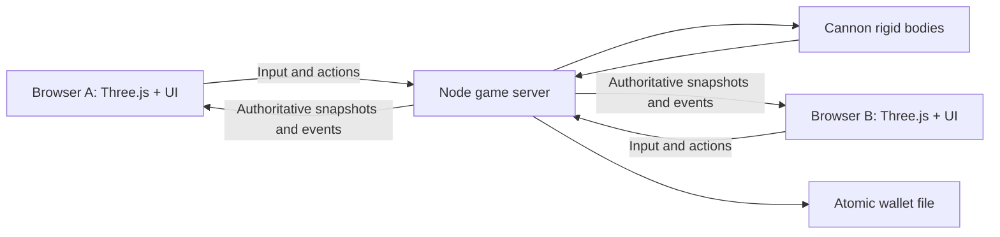

# Architecture

## Authority and transport

`server/main.ts` owns HTTP, static files, WebSocket admission, rate limits and lifecycle. `Game` in `server/game.ts` owns players, transactions, jobs, entities, laws and Cannon physics. A client submits movement intent and named actions. It never submits authoritative position, cash, health, ownership, spawn coordinates or damage.

The server targets 30 Hz simulation and 15 Hz updates. Initial joins and five-second resyncs receive a full snapshot; other frames carry changed fields and removal IDs. Encoding is shared across recipients. Slow consumers receive a fresh snapshot after backpressure. No fixed player slot cap is enforced. Spatial interest management remains future work; traffic still grows with the number of moving players and recipients.

Game messages are defined in `shared/types.ts`. The connection begins with `join`, followed by `welcome` (including a fresh or resumed bearer token and a separate ephemeral voice ticket) and a snapshot. A protocol number prevents a stale frontend from silently joining an incompatible server. Chat, notices, sound, lockpicking progress and bullet traces are transient events.

## Proximity voice

`server/voice.ts` handles a separate `/voice` WebSocket so audio congestion cannot block gameplay updates. A random ticket binds one voice socket to an active, admitted game identity. The server stamps the sender ID and forwards valid audio only to living, listening, unmuted residents inside a 28 metre sphere. Clients never choose recipients or report authoritative voice positions. Game disconnect and operator removal revoke the ticket and close audio. Origin checks, pending-join limits, a capture-rate allowance, hard flood limits, strict frame shape, sequence checks and backpressure apply independently of gameplay admission.

`client/voice-worklet.ts` resamples the microphone's native sample rate into 320-sample mono frames at 16 kHz. `shared/voice.ts` defines the versioned PCM16 packet format. `client/voice.ts` schedules short audio buffers with an initial 60 ms cushion and at most about 180 ms queued playback. Late bursts are discarded, not accumulated. Each active remote speaker gets a PannerNode with HRTF direction and linear distance attenuation, followed by a shared volume gain and compressor. Speaking indicators reflect recently received audio. Stale players, mute changes, death and disconnect cancel queued sources.

Microphone capture requires an explicit button press. Both the media track and worklet gate are disabled outside push-to-talk; disabling the mic stops all tracks. A generation counter also cancels permission requests that resolve after disconnect or cancellation. Menus, chat, key release, blur and hidden tabs stop transmission. Browser echo cancellation, noise suppression and automatic gain control are requested. Voice is not persisted or transcribed, has no wall occlusion, and is not end-to-end encrypted. PCM is broadly compatible but uses more egress than Opus; bandwidth limits still apply to crowded voice activity.

## Prediction and collision

`shared/movement.ts` provides the same movement integrator to the client and server. The client predicts unacknowledged fixed-step inputs, then replays them from the next authoritative player snapshot. Camera movement is damped to reduce visible corrections; large corrections snap to authoritative locations, including jail and respawn. Remote players and rigid bodies interpolate toward snapshots.

The server consumes one bounded movement intent per tick, regardless of the number of messages received. Stale input stops movement after 500 ms. `shared/map.ts` defines static world geometry, doorways and spawn positions. Closed doors participate in collisions and line-of-sight checks. `Cannon-es` handles dynamic prop gravity, contacts, rotations and sleeping. Player motion uses a simplified axis-aligned body; rotating props use their world-space AABBs for player/ray collision. Open door leaves are visual and are not rotating rigid colliders.

The Physics Gun uses a bounded velocity controller to pull an owned body toward an unobstructed point along the player’s view ray. Freezing turns the body static. Fading doors temporarily disable that prop's collision, then restore it on the server clock. This is not Source VPhysics or a general-purpose constraint editor.

## Economy and roleplay

Jobs and the shop catalog live in `shared/catalog.ts`; the client uses them to present options, while the server independently rechecks every transaction. A spawn must have valid space before cash is deducted. Shop transactions check stock, duplicate inventory, distance, role and price before money changes hands. There is no client-supplied custom item definition.

Votes record eligible connected identities and one ballot per identity. A majority of the original eligible roster must vote yes. Disconnects do not reduce the majority threshold; candidate disconnect cancels the vote. Role limits are rechecked when the vote completes. The one-process game loop makes these changes sequential.

Combat traces stop at walls, doors, entities or players. Ammo, reload timing, shot cooldown, spread, armor and death are server-owned. Tool access comes from the player's validated loadout. Written city laws are social rules; job permissions, warrants, lockpicks, arrests and printer confiscation are mechanical rules.

## Rendering and assets

`client/world.ts` generates the district with repeated architectural details and seeded canvas textures. Static geometry is merged by material to reduce draw calls. Buildings contain real empty ground floors. `client/entities.ts` generates prop meshes, lightweight animated residents and equipment. The renderer uses Three.js WebGL2, ambient/environment lighting, directional shadows, haze and tone mapping.

The DOM layer in `client/ui.ts` renders HUD and game menus. Player-controlled text is inserted through `textContent` or HTML escaping. Font files are bundled locally. Audio is generated through the Web Audio API after a user interaction. No remote model, texture or sound downloads are needed.

## Extending it

- Add job definitions and permissions together; never rely on hiding a client button.
- Keep map visuals and collision boxes synchronized. Add collision-only blocks for complex decorative geometry.
- Add entity size, visual and authoritative behavior together. Respect server and owner limits.
- Add tests around transactions, timers, permissions, visibility and reconnect behavior.
- Preserve protocol compatibility intentionally, or increment the protocol number on both sides.

Potential later work includes original richer art, multiple floors, player pushing/contacts, constraint tools, a map editor, verified accounts, spatial game-state networking, vehicles and persistent properties. None of those are represented as implemented systems in this release.
